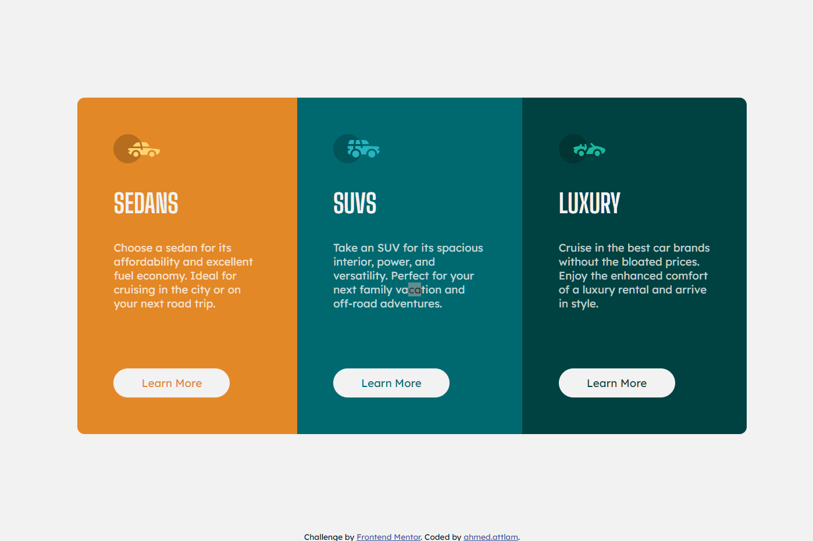

# Frontend Mentor - 3-column preview card component solution

This is a solution to the [3-column preview card component challenge on Frontend Mentor](https://www.frontendmentor.io/challenges/3column-preview-card-component-pH92eAR2-).

## Overview

### The challenge

Users should be able to:

- View the optimal layout depending on their device's screen size
- See hover states for interactive elements

### Screenshot
## Screenshots

  
  

### Links

- Solution URL: [solution URL](https://github.com/ahmedattlam10/3-column-preview-card-component)
- Live Site URL: [live site URL](https://ahmedattlam10.github.io/3-column-preview-card-component/)

### Built with

- Semantic HTML5 markup
- CSS custom properties
- Flexbox
- Mobile-first workflow

## Author

- Website - [github-profile](https://github.com/ahmedattlam10)
- Frontend Mentor - [frontend-mentor-profile](https://www.frontendmentor.io/profile/ahmedattlam10)
